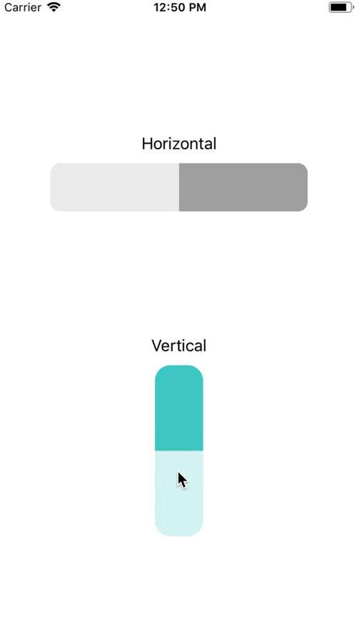

# SPSlider

[](https://travis-ci.org/ChaseStas/SPSlider)
[](https://cocoapods.org/pods/SPSlider)
[](https://cocoapods.org/pods/SPSlider)
[](https://cocoapods.org/pods/SPSlider)

## Example

To run the example project, clone the repo, and run `pod install` from the Example directory first.

https://im4.ezgif.com/tmp/ezgif-4-00a59dc33ea3.gif



## Requirements

+ Swift 4.2
+ iOS 8.0+

## Installation

SPSlider is available through [CocoaPods](https://cocoapods.org). To install
it, simply add the following line to your Podfile:

```ruby
pod 'SPSlider'
```

## Author

Stanislau Parechyn, stasparechin@icloud.com

## License

SPSlider is available under the MIT license. See the LICENSE file for more info.
